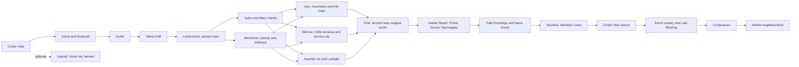

# Coronach — world and boss atlas

Draft 3, 2026-09-28. Planning only: **52 main maps across six movements, five optional destination maps, 23 major campaign encounters and five optional bosses.** Draft 3 adds Nathan's requested regions: a warmongering alien people and their volcanic forge world, an ancient town, an ancient near-magical planet, ice and swamp worlds with villages, a moving twilight town, and six distinctive new space areas. See [Draft 3 expansion](#draft-3-expansion--new-regions-2026-09-28). Maps 01–36 keep their Draft 2 numbers; new maps are 37–57. This is a content target, not a production commitment. Read with [STORY_CAMPAIGN.md](STORY_CAMPAIGN.md).

## Scale and exploration rules

Aim for a 25–30-hour core journey and 35–40 hours with substantial optional exploration. These are planning estimates, not measured playtimes. A map is a meaningful playable space, not a planet-sized simulation. Break large locations into connected authored maps with a shared skyline and clear travel transitions.

| Space | Initial footprint / traversal target | Content needed to justify the space |
|---|---|---|
| Major town | 220–380 m across; 5–8 minutes for a purposeful first circuit | 4–6 districts, 8–12 usable interiors, 12–20 recurring residents, two vertical shortcuts, one changing public space. Shop interiors are small streamed subspaces, not counted as whole destinations. |
| Ground exploration | 500–800 m across; 10–18 minutes following the critical route | Three connected loops, 6–10 combat pockets, 2–4 landmarks visible from one another, optional challenge spur and an earned return shortcut. |
| Cave / ship dungeon | 350–650 m route length, 2–3 floors; 20–35 minutes first clear | Distinct approach, pressure section, relief pocket, preview of boss arena, shortcut and a checkpoint within a minute of the boss. |
| Local space region | 1.8–3.0 km across; 4–7 minutes crossing with purposeful stops | 3–5 docking destinations or landmarks, patrol ecology, salvage branch, safe lane and a risky quicker route. Empty travel is capped at roughly 20–30 seconds. |
| Warp route | 1.2–2.2 km playable path; 12–20 minutes first clear | 4–6 differently shaped chambers, route choice, navigation mechanic, combat and a breather. A cleared transit lane supports fast return travel. |

These dimensions assume later movement tuning. Prototype in traversal seconds first and revise metre values afterward. Do not fill a large square with repeated floor modules to meet a number. Playable area, sightline length and encounter density matter more than the bounding box.

The map graph is a connected archipelago. Local space exploration leads to explicit docks; ground and ship forms transition at readable boundaries. No seamless landing feature is required. After opening a route, fast travel skips repeated cleared corridors while optional salvage lanes remain playable. Veyr and Merrow form the main midgame branch.

Draft 3 order: Xylos and Wendmire can be taken in either order; Veyr, Merrow and Hoarfell in any order. Oriel and the Vaskar Reach form one continuous chapter whose ending causes the Nacre disaster.

## How the locations advance the overarching story

The Severance is the migration that will separate the inhabited systems. The campaign objective is to bring the civilian convoy and Sorrel's young Choir through the last shared passage before Meret's Stillwater anchor closes it. Every main region below changes that operation. Its inhabitants and achievements remain present after the player leaves.

| Maps / chapter | Why the party comes here now | What the encounters change | Consequence carried forward |
|---|---|---|---|
| **01–06 Cinder, Sorrel, Hushwell, Gullet, Tallow** | Restore missing deliveries; follow a signal fault into evidence that the routes are moving and reproducing. | Burrower opens the survey access. Bellows Below guards a pressure gallery needed to reach the nursery. Freeing Cantor's collar opens passage to Tallow, proving that inhabited stations can move with the Choir. | Sela's moving chart and Tallow's first crossing create the convoy idea. The nursery, collar-release mechanics and Cinder's separation joints return in the finale. |
| **07–12 Xylos and Many Hands** | Tallow can travel but cannot support the settlements now asking to join. Growers need their own transport routes restored before agreeing to leave. | Seedthane and Floodcrown fights reopen the seed-carrier route and demonstrate mobile cultivation. Hulljack's seizure attempt makes the political cost of independent departure tangible; Meret's patrol saves a residential section during it. | Growers become participants in convoy decisions, their gardens become an inhabited hub, and the larger convoy attracts both passengers and restrictions. The gardens shelter evacuees in the finale. |
| **13–16 Veyr and Kiln Oath** | The growing civilian fleet needs lift capacity that military command has reserved for approved passengers. | Avalanche Organ threatens the extraction route; defeating Red Marshal breaks an abandonment order and lets rescue crews convert military freight capacity into civilian berths. | Idra and the crews join with their own authority. They challenge Taren's past work, lead subsequent rescues and brace Continuance's boarding spine under fire. |
| **17–20 Merrow and Understairs** | Compact clearance restrictions make rescue capacity useless to households absent from the official route records. | Warrant Engine enforces the exclusions on the ground; Glass Regent protects the survey system controlling passage. Opening the records lets residents identify their own homes and crews plot departures independently. | Oru shares survey authority, the excluded households become visible passengers, and their navigators later maintain the convoy's route. This victory and Veyr's departures provoke further Compact concentration at Nacre. |
| **21–24 Pale Exchange and Nacre Grave** | The Nacre disaster accelerates Stillwater and exposes the convoy's own dependence on one navigator and rendezvous. Nacre was introduced through earlier departures and warnings. | Lenticular blocks pumps needed for coolant and fallback shelter. Undertow Tug keeps towing toward a destroyed berth; disabling it allows the recurring crew aboard Unfinished Welcome to escape and repair the navigation system. | Several crews demonstrate a separated rendezvous before Cinder launches. They keep the final convoy moving when Sela turns back for the disabled tug. |
| **25–26 Cinder separation and Broken Ring** | Stillwater's early closure forces home to choose between its guaranteed berth and the wider convoy. | Foundry Saint attempts to reattach districts; Debris Cutter attacks them after launch. Victory commits Cinder to departure and makes its familiar skyline come apart around the player. | Shops, neighbours and portable workshops become ships and crews the player later protects. The price of leaving is visible; the heroes' home now shares the convoy's risk. |
| **27 Sorrel's second sky** | Cinder is moving, but the tightening nursery clamp blocks the young Choir from reaching the same final passage. | Mother of Doors turns the first moon's discovery into a large-scale rescue. Removing clamps opens the nursery's departure lane. | Young Choir and the civilian fleet converge at Last Mooring; saving the present and preserving future routes become one operation. |
| **28–31 Last Mooring, Continuance and Returning Passage** | The assembled convoy and nursery reach Stillwater's last anchor. | Tollkeeper opens access to the fleet; Keelbreaker opens the boarding spine; Meret's defeat permits the allies to release the anchor. The final tug rescue tests the shared navigation established at Nacre. | Each recruited community performs a known job. The blockade falls, the fleet regroups and the young Choir leave safely. No additional artifact or newly introduced power resolves the crisis. |
| **32 Neighbourhood Afloat** | The journey has changed which communities live together and how they share passage. | The player revisits the people, public spaces and relationships carried through the campaign. | A playable new civilization: familiar streets under a different sky, independent crews, new routes and continuing ties to worlds that chose to remain. |

Veyr and Merrow remain playable in either order. Their first success changes the second region's dialogue and visible preparations; Nacre's established traffic pressure reaches its crisis after both. This is an authored progression, with room to explore between events.

The optional destinations have smaller connections: **Glasswake** preserves a trainer's practice for a school aboard the convoy; **Chimera Reef** can establish an additional salvage lane; **House Without Weight** follows residents deciding which belongings and shared rooms to carry; **Stormcrown** improves the next seasonal survey shown in the epilogue. These add people, opportunities and texture. Core survival is secured by the main story, and some local activities remain independent of the central conflict.

## Main maps

Dimensions are initial greybox envelopes. Time is intended first-visit exploration, excluding extended dialogue and boss retries. Each row includes a spatial idea, so it can become a map sketch rather than just a biome label.

| ID / location | Mode, scale, first visit | Layout and play identity | Story / encounter |
|---|---|---|---|
| **01 Cinder Halo lanes** | Space safe, 2.0 km, 15–20 min | Fly around the ring, through a freight aperture and along an outer service lane. Four docks and a distant warp mouth provide orientation. Vorun stays backdrop-sized. | Opening home exterior; hails and optional courier loop. |
| **02 The Decks** | Town, 320 × 240 m, 35–50 min | Promenade, repair quarter, market, residential crescent and an old tug dock; upper footbridges reconnect at three points. Shops have real entrances and visual identities. | Taren's home, Orrin/Mira/Hal, music and small social scenes. Expand the current three rooms. |
| **03 Sorrel Ridges** | Moon surface, 650 × 500 m, 30–40 min | Ochre ravines wrap around a visible drill mast. Safe outpost, lower ore wash and upper ridge form a loop. Crater lip reveals the cave entrance early. | Existing enemies and Burrower, B01. Nathan's **Adventure Awaits** in combat territory. |
| **04 Hushwell** | Moon cave, 550 m / 3 levels, 25–35 min | Quiet mineral galleries descend to a nursery. A drill shaft is the return shortcut. Pressure pulses open side paths; safe footing is always visually legible. | B02 Bellows Below; discover the nursery through repeating structures. |
| **05 The Gullet** | Living warp route, 1.4 km, 15–20 min | Broad feeding chamber, slalom throat, salvage eddy and nursery gate; side pocket previews the Cantor before combat. | B03 Cantor; liberate its navigation collar. Existing tunnel is the prototype. |
| **06 Tallow Drift** | Station approach + town, 700 m exterior / 180 m deck, 20–30 min | Three unequal station lobes joined by flexible bridges. The wake and a drifting marker reveal that the station is moving. | End of present slice; beginning of mobile-town experiment. |
| **07 Xylos nearspace** | Space exploration, 2.4 km, 20–25 min | Orbital seed barges, abandoned weather mirror, seasonal debris stream; river delta visible below. | Establish import/export relationships, optional barge rescue. |
| **08 Rootmarket** | Jungle town, 280 × 260 m, 30–40 min | Inhabited root platforms surround a communal landing pool. Dry upper walkways and shallow lower ferries reconnect; seed houses are public landmarks. | Growers negotiate their own terms. Do not make the jungle population a single mystical culture. |
| **09 Braided River** | Jungle wilderness, 800 × 600 m, 30–40 min | Three river channels split and rejoin. Change sluices to uncover paths without trapping the player; root arches frame destinations. | Combat mixed with transport puzzles, seed-carrier recovery; **Riverbed Stomp** proposed here. |
| **10 Seedfall Reach** | Jungle cliffs, 650 × 450 m, 25–35 min | Falling seed pods serve as timed cover. Lift vines link canopy and riverbank; a beached seed carrier becomes a traversal hub. | B04 Seedthane, aggressive organism defending nesting territory. |
| **11 The Walking Canopy** | Root dungeon, 500 m, 25–35 min | A storm-driven root island shifts between three stable anchor points. The internal loops change their exits, not the player's basic controls. | B05 Floodcrown; practical agreement to grow food aboard the convoy. |
| **12 Many Hands** | Large spaceship town/dungeon, 600 m / 3 decks, repeated visits | Passenger arcade, communal galley, freight spine, new garden and exterior maintenance dock. Quiet residential areas contrast with an emergency breach route. | B06 Hulljack during first crisis; becomes a recurring social hub afterward. |
| **13 Veyr ascent lanes** | Mountain planet orbit, 2.1 km, 15–25 min | Orbiting slag islands and elevator counterweights; safe civilian corridor crosses military test ranges. | Convoy engines and a glimpse of the mountain lift. |
| **14 Kiln Oath** | Martial alien town, 340 × 270 m, 35–45 min | Rescue yards, training terraces, civilian quarter, communal kitchens and a foundry square. An emergency drill route doubles as the town shortcut. | Idra's home. Public service, command politics and ordinary family life coexist. |
| **15 Whitebreak Traverse** | Mountain wilderness, 750 × 500 m, 30–40 min | Switchback bridges, enclosed avalanche galleries and a windward plateau. Snow plumes warn of hazards; sheltered routes trade speed for safety. | B07 Avalanche Organ; civilian extraction with safe checkpoints. |
| **16 Furnace That Walks** | Mobile industrial dungeon, 650 m / 3 levels, 30–40 min | Climb ore legs, cross the rotating forge floor, reach the command bridge. Heat cycles rotate safe arena sectors. | B08 Red Marshal; win engines and rescue crews. |
| **17 Merrow mirrorwake** | Space exploration, 2.6 km, 20–25 min | Tall reflective sails, tethered garden craft and an underside service approach. Beacons and hull shapes remain readable without blinding reflections. | Noble-city arrival through its working docks. |
| **18 The Gilded Steps** | Noble alien town, 380 × 300 m, 40–50 min | Pale terraced gardens, survey halls, water courts, crowded stair markets and a public theatre. Districts connect vertically through three large lifts. | Oru's home. Different social classes and visitors share the city. |
| **19 Understairs** | Ship/station service district, 600 m / 3 levels, 25–35 min | Lift shafts, kitchens, maintenance bridges and densely occupied utility rooms; climb into spaces visible from the noble terraces. | B09 Warrant Engine; expose the missing households through inhabited space. |
| **20 The Open Ledger** | Observatory/civic dungeon, 450 m, 25–35 min | Survey galleries rearrange defensive shutters, creating short loops around a central open-air machine court. | B10 Glass Regent; alter access rights rather than steal a royal jewel. |
| **21 Pale Exchange** | Comet-port town, 260 × 220 m, 25–35 min | Blue ice vaults, warm market tents, water loading quay and shaded radiator field. The comet's slow tumble gives the sky movement. | Acquire coolant and rendezvous shelter; restful late-game stop. |
| **22 Blue Lung** | Comet interior, 500 m / 2 levels, 25–35 min | Dark pressure lakes divided by ice ribs; traversable air shelves and floodgate shortcuts. Cold damages only in clearly marked hazard pockets. | B11 Lenticular; open a disabled pumping system. |
| **23 Nacre Grave** | Space wreck field, 3.0 km, 25–35 min | Fresh wrecks from the transfer disaster intersect an older salvage spiral. A survivor beacon and intact tugs reward branching exploration. | Reach the disaster heard in earlier chapters; establish a shared fallback rendezvous. |
| **24 The Unfinished Welcome** | Stranded passenger ship, 650 m, 25–35 min | Arrival lounge built for passengers who never boarded, branching cabin decks and inverted docking machinery. Mostly maintained, not another uniformly rusty derelict. | B12 Undertow Tug; rescue the recurring tug crew and test distributed navigation for the final evacuation. |
| **25 Cinder Halo, separation day** | Returning town + machinery, existing 02 plus 400 m service route, 40–60 min | Familiar streets close one by one; new access beneath the promenade exposes its ship origins. Final walk through districts precedes combat at the separation plant. | B13 Foundry Saint; Coronach ceremony and launch. Reuse the town with deliberate state changes. |
| **26 The Broken Ring** | Space action, 1.8 km, 15–20 min | Fly beside departing town sections. Debris moves through marked channels; docks and family hull colours guide escort priorities. | B14 Debris Cutter; defend the launch. No arbitrary civilian-loss score. |
| **27 Sorrel's second sky** | Returning moon + nursery approach, 650 m, 25–35 min | The same ridge skyline now shelters moving juveniles. Previously drilled voids become flight apertures leading to fixed ground landing shelves. | B15 Mother of Doors; remove an anchor clamp without destroying the nursery. |
| **28 Last Mooring** | Warp fleet approach, 2.2 km, 20–30 min | Heavy anchor chains divide broad arenas. Dockable maintenance islands separate flight trials; convoy routes remain visible nearby. | B16 Tollkeeper; break the outer blockade. |
| **29 Continuance exterior** | Space / ship deck dungeon, 800 m, 25–35 min | Fly the engineering vessel's length, dock on maintenance platforms, then take lifts across a visibly moving superstructure. Transitions are explicit. | B17 Keelbreaker; open the anchor chamber. |
| **30 Stillwater chamber** | Final ground/flight arena complex, 300 × 240 m, 20–30 min | Two dock-linked arenas: open frame gantry and compact circular control well. Three clear cover anchors survive every phase. | B18 Meret Venn and Continuance; final major combat. |
| **31 The Returning Passage** | Flight finale, 1.5 km, 10–15 min | An opening route gives a fast convoy run, then an optional-looking distressed tug becomes the authored final rescue. No surprise new boss. | The heroes turn back and still make the rendezvous. |
| **32 Neighbourhood Afloat** | Epilogue town, 320 × 240 m, 20–40 min | Reused town/ship modules arranged into new streets; saved public spaces and residents reflect side stories. Accessible postgame travel terminal. | Playable resolution, remaining side quests and expert boss rematches. |

## Optional destinations

These four maps can be cut without damaging the campaign spine. Boss rewards are distinctive sidegrades and cosmetic ship details, not mandatory stat jumps.

| ID / place | Map plan | Optional boss / payoff |
|---|---|---|
| **33 Glasswake** | Airless vitrified moon, 600 × 450 m. Dark glass dunes, buried observatories, branching fissures; navigation by silhouette rather than reflective noise. | **The Unfinished Duel**, an abandoned sparring machine copying the player's *previous* attack category with a visible tell. Recover a trainer's unfinished lesson, not an ancient superweapon. |
| **34 Chimera Reef** | Space ecology preserve, 2.4 km. Slow-moving stone organisms form temporary lanes around three permanent landmarks. | **Ninefold Kite**, a colony creature splitting into independently readable wings. Expert lock-on and prioritisation. |
| **35 The House Without Weight** | Rotating residential habitat, 550 m across three decks. Plane-locked play on authored walkable surfaces; rotating rooms reposition bridges between encounters. | **Host of Rooms**, a maintenance swarm moving furniture-sized shells through the house. Recover residents' belongings with their specific permission. |
| **36 Stormcrown** | Veyr summit, 650 × 400 m. Sheltered chimneys, suspended weather instruments, a storm observatory with a return cable. | **Brass Weather**, a three-stage lightning collector. Earn an alternative counter drive and a route survey epilogue scene. |

## Draft 3 expansion — new regions (2026-09-28)

Nathan asked for more space areas, each distinctive, and more planets and towns: a warmongering alien people, a volcanic world near them, an ancient town, an ancient near-magical planet, ice and swamp worlds with villages, and a few more. Each addition has a job in the Severance so that it strengthens the campaign instead of widening it. The estimated core length rises from 25–30 hours to about 40–46; these are planning estimates, not measurements.

### Peoples introduced

- **The Vaskar and the Muster.** The Vaskar are a tall, plated people with crest-sails. Their state, the **Muster**, is organised for conquest: rank comes from campaigns won and routes held, and foundry clans are conscripted. The Muster reads the Severance as the war of the age. Worlds cut off from the departing routes will be defenceless, and whoever holds a caged passage can reach them, and rule them, for generations. Following designs looted from Oriel, it is forging **Bridles**, cages that leash young Choir into private war-roads, and it wants Sorrel's nursery. Not every Vaskar is a soldier. The **Unsworn** refuse the muster-oath; they are deserters, conscripted smiths and the families who hide them. The Rauk of Veyr have held the frontier against Muster raids for generations, which is why Kiln Oath is militarised and why Idra knows Vaskar tactics. Meret cites the Muster as proof that open routes invite conquest; Stillwater's protected corridor is her answer.
- **The Ancelane and the Wick-folk.** The Ancelane lived through the *previous* Severance, long before written memory. Most of their towns moved with the Choir. The rulers of their homeworld, **Oriel**, tried to bridle a passage instead, and broke their world. Their descendants, together with the many peoples who later adopted their customs, keep the lanterns of **Lanternwick**, and the Coronach leave-taking comes from their tradition. Ancient technology here looks magical but obeys one visible rule (see Oriel). It provides evidence and a mechanical principle, never a relic that solves the ending.
- **Lastlight herders** (Hoarfell): rime-beast herders who live inside the ribcage of an adult Choir that froze on their world during the last Severance. They understand Choir cold-dormancy better than any surveyor.
- **Driftreed raft-folk** (Wendmire): a swamp people whose woven-reed town already drifts with the tides. They are experts in air-scrubbing reed mats, water stills and floating habitation.
- **The Meridian Crawlers** (Duskline): a whole town on treads, circling a tidally locked world to stay in its habitable twilight. Nobody knows more about moving a town without breaking it.

### How the new regions change the story

| Where | Why the party goes now | What changes | Carried forward |
|---|---|---|---|
| **Lanternwick** (after Tallow) | Sela's moving chart matches a lantern pattern from an old courier tale. | The Wick-folk archive shows that towns survived the last Severance by moving, and that Oriel fell by trying to cage a route. The first Muster scavengers are seen looting relay towers. | The convoy gains historical proof; the Wick-folk relay lanterns become the visual beacon chain for distributed navigation. |
| **Wendmire** (either order with Xylos) | Many Hands can carry food from Xylos but cannot keep its air and water clean. | Rotbloom, a predator luring raft-folk with light, is killed in the Drowned Waystation. Driftreed agrees to join as a floating district that keeps its own rafts. | Reed air-mats keep a breached town section breathing in the finale. |
| **Hoarfell** (any order with Veyr and Merrow) | The nursery will have to cross a cold passage, and nobody knows how to keep juveniles alive through it. | The Muster is thawing an ancient Ancelane army from the glacier. The party collapses the thaw rig and puts the Host Marshal back to sleep; this is the first sight of the Muster in force. | Lastlight herders travel with the convoy to keep the young Choir dormant through the final passage. |
| **Oriel** (opens Movement IV) | The Muster's Bridles come from Oriel's plans; to break them, someone must learn how they were released. | The Last Warden stands down once shown the release. The party sees the glass-turned Choir that the first Bridle killed. | The release principle is applied by crews at Scoria, and later with Cantor's collar, Veyr's furnace and Cinder's joints at Stillwater. |
| **Vaskar Reach** (Picket, Corona, Scoria, Harrowgate) | The Muster attacks the convoy and cages a route to reach Sorrel. | The Slag Colossus is destroyed and a caged juvenile freed at the Bridle Foundry. Conscripted Unsworn smiths join. At Harrowgate the Unsworn rise and Warmaster Drask is defeated and deposed. | Drask's standing order springs a Bridle on the Nacre route. That thrashing Choir causes the Nacre berth disaster, and Meret launches Stillwater early. The Unsworn forge the finale's release gear from Bridle metal. |
| **Duskline** (before Cinder separation) | Cinder Halo must learn to move its districts before it can launch. | The party races the dawn across the Terminator to recover the Crawl's stalled tread section. | Crawler engineers help Orrin's crews separate and propel Cinder's districts. |
| **Updraft** (optional, from Act I) | Vorun's cloud-harvesters sell fuel; their kites are being torn apart by storms. | An optional storm organism, Thunderhead. | Harvest kites refuel the convoy at Last Mooring (optional texture, never required). |

### New main maps

| ID / location | Mode, scale, first visit | Layout and distinctive rule | Story / encounter |
|---|---|---|---|
| **37 Lanternwick** | Ancient town, 220 × 180 m, 30–40 min | Carved canyon terraces around Ancelane lantern-towers whose crystal lamps brighten when a Choir passes overhead. Districts: lantern stair, market under the great arch, keepers' archive (a wall of light patterns), orchard terraces and courier dock. Towers pivot to relay light down the canyon. | Wick-folk history, the origin of the Coronach custom and the Oriel warning. **Old Village**. |
| **38 Lantern Gorge** | Canyon exploration, 600 × 350 m, 20–30 min | Fallen relay towers across a dark gorge where cave-grazers hunt in darkness. Realigning relay mirrors lights a safe path, and light also repels the grazers. | First face-to-face Muster scavenger crew; elite Scav-Captain. |
| **39 The Spore Veil** | Space, 2.2 km, 15–20 min | A bioluminescent spore nebula. Drifting pods burst into blinding clouds, and ship lights attract spore swarms. Fly dark between Driftreed's pulse beacons. **Rule: visibility is the resource.** | Arrival at Wendmire through its own traffic lights. **Starfield Frontier**. |
| **40 Driftreed** | Swamp raft village, 240 × 200 m, 30–40 min | Woven-reed raft districts on rope bridges: stilt market, smokehouse, weaving halls and a floating school. High and low tide re-pair which rafts connect, giving two authored layouts that are both coherent. | Raft-folk negotiate their own terms. **Despano Lopo**; shops **Shop Theme**. |
| **41 Mirefen** | Swamp wilds, 700 × 550 m, 30–40 min | Mangrove giants and peat islands. Three moons' tides, visible in the sky, flood and drain channels on a readable cycle. Fog banks and glow-fungus trails; knee-deep water slows footwork. | Ground combat on shifting footing. **Swamp Sprint**. |
| **42 The Drowned Waystation** | Ruin dungeon, 450 m / 2 levels, 25–35 min | A half-sunk Ancelane route station. Restarting old pumps drains halls in stages and opens shortcuts. | **B19 Rotbloom**. |
| **43 Aurora Shear** | Space, 2.4 km, 15–20 min | Hoarfell's magnetic storms form visible aurora currents: ride with them for speed, cross them against drag and shield drain. A shattered ice ring surrounds the planet. **Rule: current-riding lanes.** | Approach through a storm the herders read like weather. **Starfield Frontier**. |
| **44 Lastlight** | Ice village, 200 × 160 m, 25–35 min | Built inside the ribcage of a frozen adult Choir; vents beneath keep the rib-halls warm. Longhouses, a vent bath-house, carving yard, beast pens and a lamp shrine. The streets follow the skeleton, with warm and cold zones. | Herders' dispute about leaving their dead Choir. **Village Circle**. |
| **45 The White Reach** | Glacier wilds, 750 × 500 m, 30–40 min | Crevasse fields, wind-carved seracs and migrating rime-beast herds. Wind telegraphs each whiteout; shelter at vent pockets. | Muster excavation crews and ice predators. |
| **46 The Frozen Host** | Glacier dungeon, 550 m / 3 levels, 30–40 min | An Ancelane army of Bridle-guard constructs frozen in blue ice, with Muster thaw-rigs waking them rank by rank. The thaw spreads as the player descends. | **B20 Host Marshal**. **March of the Frozen Host**. |
| **47 The Orrery** | Space, 2.6 km, 20–25 min | Oriel's broken moons still ride ancient light-rails around the planet like clockwork, and rings open and close in sequence. **Rule: the whole region is one readable machine.** | Arrival at a world that looks impossible. **Starfield Frontier**. |
| **48 Oriel Skyfields** | Near-magical planet, 700 × 600 m, 30–40 min | Islands float along still-live route fibres, rivers run upward along light-threads, and glass forests ring under pressure. Gardener automatons tend empty gardens. **Visible rule: where a severed route fibre still runs, weight and light follow it.** Fibres are glowing lines; only islands on them float, and their lift carries the party between islands at marked nodes. | The ruin of a world that tried to hold a route still. **Glass Ruans**. |
| **49 The Glass Choir** | Ruin dungeon, 500 m, 30–40 min | A cathedral built around an adult Choir the Ancelane bridled, its body turned to glass around the original Bridle engine. | **B21 The Last Warden**. |
| **50 The Picket of Teeth** | Space, 2.8 km, 20–25 min | The Muster border: flak-curtain gates, sensor buoys and carrier patrol loops. Tumbling asteroids cast sensor shadows. **Rule: detection escalates in visible stages (warning, hunter wing, carrier)**, so the player can go quietly or fight. | Crossing into Vaskar space. **Galactic Conquest**; fights **Starfight**. |
| **51 The Corona Line** | Space, 2.0 km, 15–20 min | Scoria's unstable red star throws flares on a visible cycle; the sky whitens before each. Ejecta rivers flow between basalt shield-rocks. **Rule: flare timing and cover.** | Approach to the forge world. |
| **52 Scoria Flows** | Volcanic planet, 750 × 550 m, 30–40 min | Lava deltas crust over and break on cycles, with colour showing which crust is safe. Obsidian shelves, ash storms and the camps of conscripted foundry clans. | Free Unsworn crews under Muster garrisons. **Alien Pulse**. |
| **53 The Bridle Foundry** | Forge dungeon, 600 m / 3 levels, 30–40 min | A magma-powered forge building Bridle cages from Oriel's plans, with a caged juvenile Choir at its heart. | **B22 Slag Colossus**; free the juvenile. |
| **54 Harrowgate** | Vaskar capital town, 360 × 280 m, 40–50 min | Basalt terraces around a war harbour: muster fields, the oath hall, armourers' streets, family quarters, trophy galleries of conquered worlds and the hidden Unsworn quarter. It is an institution of war, but people live ordinary lives in it. | **B23 Warmaster Drask Vaal**. **Galactic Conquest**. |
| **55 Meridian Crawl** | Moving town, 260 × 120 m on treads, 2 decks, 30–40 min | A town on enormous crawler treads, keeping ahead of dawn in a twilight band. Tread-halls, a swaying market street, a sky-garden deck and the helm. The horizon light always shifts, because the town never stops. | Crawlers teach Cinder's crews to move districts. **Dventure at Dusk**. |
| **56 The Terminator** | Twilight surface, 800 × 300 m band, 20–30 min | A stalled tread section lies on the day side while the lethal dawn line advances visibly. Recover and re-mate it while heat-scavengers attack. | Escape set piece: outrun the dawn. There is no boss. |

**Optional 57 Updraft.** Vorun's upper atmosphere, with a sky town on harvest-kite platforms and atmospheric flight with lift and turbulence (**rule: flight with air**). Optional boss **Thunderhead**, a storm organism. It is available from Act I.

### Every space area has its own rule

| Space area | What makes it play differently |
|---|---|
| 01 Cinder Halo lanes | Civil traffic, docking and home orientation |
| 05 The Gullet | Inside a living route: chambers, throat and nursery gate |
| 07 Xylos nearspace | Seed barges and a weather mirror; rescue around moving cargo |
| 13 Veyr ascent lanes | Slag islands and live military test ranges |
| 17 Merrow mirrorwake | Reflective sails; glare and hull silhouettes |
| 23 Nacre Grave | A wreck field with a salvage spiral |
| 26 The Broken Ring | Escorting departing town sections |
| 28 Last Mooring | Arenas divided by anchor chains |
| 31 The Returning Passage | The convoy run and the turn-back rescue |
| 34 Chimera Reef (optional) | Living stone organisms form temporary lanes |
| **39 The Spore Veil** | Light discipline and visibility |
| **43 Aurora Shear** | Current-riding for speed and drag |
| **47 The Orrery** | Clockwork rails and timed rings |
| **50 The Picket of Teeth** | Staged detection and stealth |
| **51 The Corona Line** | Flare cycles and heat cover |
| **57 Updraft (optional)** | Atmospheric lift and turbulence |

### New bosses

| ID / boss | Signature encounter and phases | Ending |
|---|---|---|
| **B19 Rotbloom** | A floating bloom colony whose lures mimic Driftreed's lamps. Burn lure-stalks to expose feeding mouths; the drained arena shrinks the safe water between phases. | Genuine predator, killed. |
| **B20 Host Marshal** | An Ancelane construct commander waking its ranks. Break thaw-rig couplings as it rallies thawed soldiers; its final phase fights within a closing ice cage. | Disabled and returned to sleep; the thaw rig collapses. **Boss of the Ages**. |
| **B21 The Last Warden** | A guardian still enforcing the first Bridle. Its attacks follow the fibre lines, so reading the lines reads its tells. Each released clamp changes its arena. | Stands down once shown the release. **Boss of the Ages**. |
| **B22 Slag Colossus** | A walking crucible war-engine. Cool its armour with coolant sluices, break the pour-arms, then fight on the cooling slag floor. | Machine destroyed; the juvenile is freed. **Glitch Boss**. |
| **B23 Warmaster Drask Vaal** | A duel on the muster field against a war-frame lance and command shouts that summon guard wings. The second phase is a flight pursuit over the war harbour. | Defeated and deposed by the Unsworn, then arrested rather than executed. **Alien Boss Battle**. |
| **O5 Thunderhead** (optional) | A storm organism in Vorun's clouds; lightning follows visible charge build-up. | Driven off; the harvest lanes reopen. |

### Music map

Nathan's supplied tracks (27 unique, listed with hashes in [docs/music/tracks.json](music/tracks.json)) cover almost every region:

| Cue | Track |
|---|---|
| Title / home town / shops / Sorrel combat (current) | Title Theme / Hub Town Groove / Moonbase Market / Adventure Awaits |
| Space combat (current: Gullet, flight arena) | Starfight |
| Boss encounters (current: Burrower, Cantor) | Alien Boss Battle |
| Hushwell | Moon Caverns |
| Xylos | Jungle Planet Groove, Riverbed Stomp, Seed Shakers of Xylos |
| Merrow, the Gilded Steps | Regal Alien Town |
| Lanternwick | Old Village |
| Driftreed / Mirefen | Despano Lopo / Swamp Sprint |
| Lastlight / The Frozen Host | Village Circle / March of the Frozen Host |
| Oriel | Glass Ruans |
| Scoria / Harrowgate and the Picket | Alien Pulse / Galactic Conquest |
| Duskline | Dventure at Dusk |
| New-region space exploration | Starfield Frontier |
| Travel between regions; Many Hands exterior | Starward Journey |
| Quiet long lanes (Nacre Grave, Returning Passage) | Endless Flight |
| Machine bosses / ancient bosses / finale | Glitch Boss / Boss of the Ages / Final Stand |
| Merchant variant | Shop Theme |

Still uncovered: Veyr (Kiln Oath, Whitebreak), Pale Exchange, Many Hands interior, the Cinder separation walk, Updraft and a dedicated finale-flight cue.

### Production reality

At this draft's September 28 snapshot, five of the 52 main maps existed in any form, none at its planned scale, and 405 Meshy credits remained. Those are historical figures: use [PROGRESS.md](PROGRESS.md) for current implementation and the current art ledger/live balance before spending. The expansion should be built as it was planned: greybox first, one region at a time, with a generated kit per region only after its blockout passes MAP_EYE_TEST and its combat plays well. Proposed order after the current workshop and first chapter: Lanternwick with Xylos/Many Hands, then Wendmire; Veyr, Merrow and Hoarfell; Oriel and the Vaskar Reach; Pale Exchange, Nacre and Duskline; the Cinder launch and finale; the optional maps last. If scope must shrink, cut optional maps first, then the Lantern Gorge, then one of Wendmire or Hoarfell (their finale contributions can be merged), before cutting combat quality or the ending.

## Boss direction

Bosses must support the combat hook: readable anticipation, committed attacks, dodge/guard opportunities, break windows and generous retry access. Enormous spectacle does not excuse a distant camera or a tiny player. Rough target: 3–5 minutes for campaign bosses, 5–7 for chapter finales, with difficulty coming from patterns rather than inflated health. Rebalance the slice's much shorter prototype fights only after animation timing is settled.

| ID / boss | Signature encounter and phases | Mastery / outcome |
|---|---|---|
| **B01 Burrower** | Armoured excavation beast dragging an active drill rig. Bait a charge into spoil piles, then fight beside the exposed drive. Second phase breaks the arena into two looped ridges. | First clear wind-up/evade/punish lesson; rig disabled. |
| **B02 Bellows Below** | Cave predator inflates connected chambers before striking through openings. Break one pressure organ to choose the safe half of the room; last phase moves across exposed ribs. | Position and break timing; genuine dangerous predator can be killed. |
| **B03 Cantor** | Giant route serpent coils through a broad flight chamber. Cut collar links in any order, each changing its sweep and projectile pattern; final pass targets the lock. | Fire for reach, lunge for openings, roll through song waves; animal released. |
| **B04 Seedthane** | Tall many-legged seed carrier sweeping thorn fans. Knock hanging pods loose for temporary cover; its planted and mobile phases offer different break targets. | Ground target switching; drive it away from the crossing. |
| **B05 Floodcrown** | Amphibious crown of antlers and water gates under the moving canopy. Chase across three rooted arenas, sever flood controls, then duel in a draining basin. | Read the creature, not a QTE; survive the storm and recover seed transport. |
| **B06 Hulljack** | Salvage exosuit stalking the outside and inside of Many Hands. First sever magnetic feet in flight, then board and fight the exposed operator in a freight hall. | First boss combining both forms with a checkpointed docking transition; capture. |
| **B07 Avalanche Organ** | Cliff-spanning resonator with a mobile central creature. Attacks shake specific snow shelves; destroy emitters to open a climb, then fight on the summit ring. | Hazard forecasting, guardable close attacks and optional risky punish windows. |
| **B08 Red Marshal** | Armoured officer with a furnace lance. Precise duel becomes a moving-platform fight as the furnace walks; armour breaks reveal shorter, faster commitments. | Perfect guard, short combos and restraint. Human-scale rival with no giant-monster transformation. |
| **B09 Warrant Engine** | Six-legged enforcement machine deploys line barriers like moving walls. Break its stamping arm to interrupt a barricade, exposing alternate routes around its shield. | Flanking and partner swap; disable the eviction machinery. |
| **B10 Glass Regent** | Survey construct suspends three mirrors that redirect clearly marked attacks. Destroying a mirror changes arena geometry; final phase uses the stripped frame as a duellist. | Player deliberately shapes the arena; preserve visual clarity without screen-filling refraction. |
| **B11 Lenticular** | Flattened ice predator slides under transparent shelves. Track its visible silhouette, strike surfacing fins and use opened pumps to choose the final arena. | Aim and anticipation, no attacks from invisible water. |
| **B12 Undertow Tug** | Autonomous rescue tug has entangled its own tow lines around a passenger ship. Fight its thruster bursts in space, then its cutting arms on a docking deck. | Lunge between anchors; restore a machine performing the wrong rescue. |
| **B13 Foundry Saint** | Cinder Halo's old separation press, held upright by six heavy arms. A Compact override makes it reattach departing sections. Fight through a familiar industrial interior to its controller. | Apply established break rules to a large machine; reconnect control to local crews. |
| **B14 Debris Cutter** | Compact interception craft weaves through the departing ring. Player selects which of three weapon pods to disable first; its pursuit behaviour changes accordingly. | Sustained flight duel near clear landmarks; protect the launch without a strict escort-health gimmick. |
| **B15 Mother of Doors** | Adult Choir wrapping around its trapped nursery. Opening clamps changes its escape path; retaliatory sweeps have generous readable lanes. Final phase races alongside it to the last clamp. | Difficult rescue expressed through combat, not attacking a friendly health bar to zero. |
| **B16 Tollkeeper** | Anchor-fleet carrier whose outriggers form a moving cage. Destroy selected braces, weave out, dock briefly on an arm and disable its gate motor. | Flight routes and transition control; blockade opened. |
| **B17 Keelbreaker** | Continuance's autonomous maintenance frame slides along the exterior rail. Fighting removes pieces of rail, altering approach angles while permanent safe platforms remain. | Mobile positioning and aggressive windows; gate to final chamber. |
| **B18 Meret / Continuance** | Ship duel; exterior frame fight; close emergency-frame duel. Her shield reflects established counter rules and her clamps reshape lanes with visible warnings. No fourth surprise health bar. | Full combat vocabulary, short checkpointed phases, defeat without compulsory execution. |

Add roughly eight elite encounters by remixing enemy squads and terrain, not by commissioning eight more giant models. Their purpose is to teach a later boss mechanic: a shield officer, pulse burrower, mine shepherd, tow-drone pair, mirror sentry, seed ambusher, thermal lancer and anchor gunner.

## Region production kits and audio

| Kit | Reusable pieces | Distinctive features that must not be generic props | Music direction |
|---|---|---|---|
| Cinder / Many Hands | Hull modules, doors, rails, shops, utility machinery | Curved market promenade, mismatched tug bows, separation joints, inhabited galley | **Hub Town Groove** in first town; **Moonbase Market** while shopping; **Title Theme** on title. |
| Sorrel / Hushwell | Rock faces, drill equipment, crystals, supports | Crater skyline, pressure ribs, drilled nursery wall | **Adventure Awaits** on entering the moon combat area. |
| Choir routes | Membrane walls, rooted apertures, organic anchors | Each route's chamber silhouette and traversal flow | **Starfight** in the Gullet's combat route (implemented September 28); **Alien Boss Battle** for Cantor. |
| Xylos | Root platforms, trunks, water channels, leaf shelters | Mobile seed islands, braided river, walking canopy | **Riverbed Stomp** proposed for river traversal; **Seed Shakers of Xylos** for canopy exploration. Reserved until these maps exist. |
| Veyr | Basalt/snow cliffs, bridges, rescue equipment, furnace blocks | Walking forge, avalanche galleries, civilian rescue yards | Percussive ascent and martial-town cues to compose later. |
| Merrow | Pale terraces, stairs, lifts, garden modules, survey screens | Open theatre, dense service city and survey court | Formal melody with audible working-district variation. **Shop Theme** reserved for a future merchant variant. |
| Comet / wrecks | Ice ribs, insulated tents, hull fragments, transfer machines | Warm water quay, unoccupied arrival lounge, spiralling grave harbour | Quiet late-game travel and pressure-combat cues later. |
| Anchor fleet | Heavy clamps, chains, gantries, frame platforms | Continuance silhouette and staged final arenas | **Final Stand** for Meret and the Continuance; **Endless Flight** for the Returning Passage. |
| Ancelane (Lanternwick, Oriel) | Carved terraces, lantern-towers, glass ruin modules, fibre lines | Relay towers that pivot, floating islands only along visible fibres, the glass-turned Choir | **Old Village**, **Glass Ruans**, **Boss of the Ages**. |
| Wendmire | Reed rafts, rope bridges, mangrove trunks, peat islands, pumps | Tide-paired raft districts, three-moon tide sky, spore nebula beacons | **Despano Lopo**, **Swamp Sprint**, **Shop Theme**. |
| Hoarfell | Ice cliffs, seracs, vent pockets, longhouses, rib arches | A village inside a frozen Choir skeleton; the frozen army in blue ice | **Village Circle**, **March of the Frozen Host**. |
| Vaskar Reach | Basalt terraces, war-harbour cranes, flak gates, forge vats, lava crust | Muster fields and trophy galleries; Bridle cages; staged border detection | **Galactic Conquest**, **Alien Pulse**, **Alien Boss Battle**, **Glitch Boss**. |
| Duskline | Tread modules, swaying street decks, heat shields | A town that never stops moving; the visible dawn line | **Dventure at Dusk**. |

All new visible art remains generated. Existing downloaded assets are donors, particles, glyphs, fonts and sound only. Do not spend the remaining slice Meshy budget building this entire atlas. Reuse kit geometry judiciously, but commission hero landmarks and bosses only when their greybox play proves worthwhile.

## Build order and exit criteria

1. Finish the current gameplay workshop: sharp surroundings, convincing locomotion, authored attack silhouettes, reliable hit timing, readable ship forms and working music transitions.
2. Expand **The Decks → Sorrel Ridges → Hushwell** as the first polished chapter. Prove a real town loop, one substantial exploration map, a dungeon and two contrasting boss encounters before expanding scope.
3. Build **Xylos + Many Hands** to prove the second environment kit, persistent changing hub and mixed ground/flight boss structure.
4. Greybox **Veyr and Merrow** in parallel production tracks only when staffing supports it. Finish one complete chapter before generating all the other's art.
5. Build the return-state maps and finale using demonstrated systems. Cut optional destinations before cutting combat polish or the playable ending.

Every map needs an overhead route sketch, travel-time test, encounter plan, sightline blockout, lighting target and asset budget before art production. Every boss needs a small playable pattern prototype with animation/contact review before its final model. Reject a map if its paths differ only by props or if its scale creates filler travel.

Every release map must also pass **MAP_EYE_TEST** in [PRODUCTION_PLAN.md](PRODUCTION_PLAN.md), at blockout and after final art. Establish purpose, room/terrain relationships, believable construction, usable public/service routes and coherent exterior/interior scale. Fantasy rules must be apparent and consistent in the scene. The first station's layout is explicitly rejected pending redesign; attractive generated modules and a traversable path do not establish a believable place. Record a functional map brief plus overhead/section views and inspect the actual arrival/walking experience before accepting each zone.

Each main map and boss also needs a narrative review: identify the earlier event that brings the party here, what the player changes, the visible aftermath and the later scene that uses that change. A region fails if its inhabitants and achievements disappear when the next biome loads. Use the campaign connections above as requirements when writing quests and blocking scenes.
